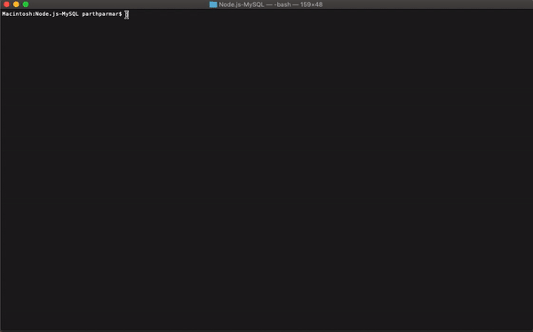

# Node.js-MySQL

## Objective

The objective of this app is to allow the user purchase products from bamazon using the CLT (command line terminal).

##  Organization

The app is organized in a javascript file that runs the app and a mysql database that houses the data.
- **main file** -- bamazonCustomer.js
    - accepts user input from CLI using Inquirer 
    - connects to mysql database and executes sql statements to retrieve  or update data in / from database

- **database** -- mysql.sql
    - sql to create database, tables and seed data

## How to Run

1. clone or fork repo to your computer using git commands or github's website
2. run ```npm install``` in CLI to download required node modules to run app
3. navigate to folder with file contents in CLI (e.g. terminal)
4. enter the following line:
    - ```node bamazonCustomer.js```
5. select Buy
6. select or enter the item id for which you would like to purchase
7. enter the qty would you like to purchase
8. exit or buy more things

## Deployment

link: None

**Local Use Only**

## Technologies Used

- npm: to install required modules
- inquirer: user input 
- mysql: to connect to a mysql database and run sql syntax for data query or data update
- cli-tables: to generate pretty tables in CLI with custom headers and lines

## Contact

Parth Parmar -- developer of the bamazon shopping app using the technologies mentioned above

## Demo

### App Function

